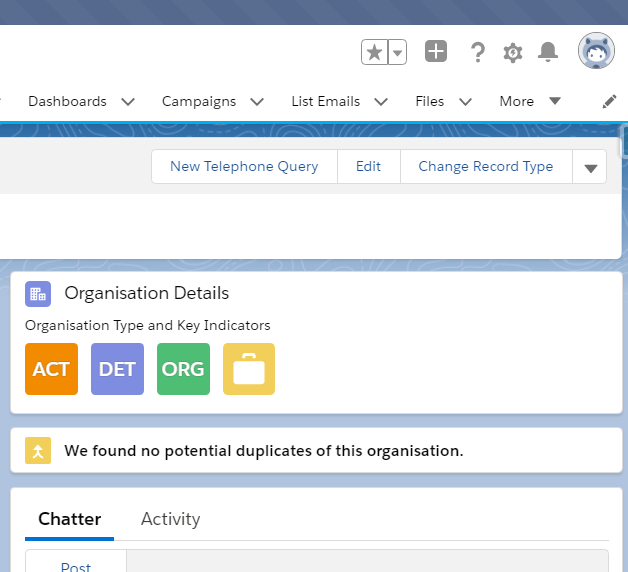
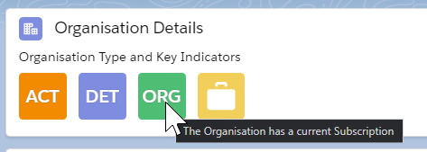

# Indicators Lightning Web Component

Bring some colour and visibility to the data on your Lightning Pages. Allow users to see at a glance what this record is about and what it's status is. This component is highly customisable and can be used in many record pages. 

The icons are based off the standard Lightning Web Component - [Avatar](https://developer.salesforce.com/docs/component-library/bundle/lightning-avatar/example).

See the Wiki Page from [The Detail Department Wiki](https://tddprojects.atlassian.net/wiki/x/CYBTPQ) for more details about the history, and reason for this component. 

Deploy this component to your Salesforce org.

<a href="https://githubsfdeploy.herokuapp.com">
  
</a>

# Steps

* Add the **IndicatorsListView** Component to the Lightning Record Page. 
* Enter the Settings for the Lightning Card:
  * **Title** - Not Required, but looks best if it is defined
  * **Icon** - Not Requiried, but looks best if it is defined - the icon name from [SLDS Icons](https://www.lightningdesignsystem.com/icons/) or default icons such as standard:account, standard:opportunity
  * **Heading Text** - _Optional_ - the text to display above the icons
  * **Icon Size** - large or medium, defaults to large
  * **Icon Shape** - circle or base (square), defaults to base
* Enter the Settings for each Indicator:
  * **Indicator Field Names** - the exact API Name of the field to display - case is important. Separated by a semicolon. 
  * **Indicator Icons** - the icon name from [SLDS Icons](https://www.lightningdesignsystem.com/icons/) or default icons such as standard:account, standard:opportunity separated by a semicolon
  * **Indicator Text Values** - the three character (max) text values to show for each icon. Separated by a semicolon. Eg enter ;; if there are 3 icons with no text.
  * **Indicator Image URLs** - the full URL of the Image to display, separated by a semicolon. Note: No quotation marks. 
  * **Indicator Hover Texts** - the text to display on hover. Keep it short. Separate by semicolons. No semicolons in the text. No wrapping allowed. 
* After entering all settings, the Indicators should display on the Lightning Page preview and will then change in the preview as you adjust the settings. 
* Click **Save**
* Test a boolean field to ensure the indicator disappears if false.

  _Hint:_ Use the [configuration worksheet](https://docs.google.com/spreadsheets/d/1e-Qxi0MY9An9Hb9mHPVxFom--HCNK6xNRkWO12xRxg0/edit?usp=sharing) ([Make your own copy](https://docs.google.com/spreadsheets/d/1e-Qxi0MY9An9Hb9mHPVxFom--HCNK6xNRkWO12xRxg0/copy)), I've created to help you work out the whole component before you set it up on the page.

## Rules
* The indicators work with Boolean or Text fields. 
* If the field is a Boolean and the value is False the Indicator will not show.
* If there is a value in *Indicator Image URLs* that image will show.
* If the field is a Boolean and there is a value in *Indicator Text Values* then that text will show. Limit this text to 3 characters max, and Uppercase. 
* If the field is a Boolean and there is no value in *Indicator Text Values* the Icon will be shown.
* If the field is a Text field the first 3 characters will show, in Uppercase.
* If there is a text value, the Icon image will not be shown, but the colour will be from the SLDS icon name entered.
* There is no field validation to ensure you don't use a Date field or similar, so if it looks strange, just go back to simple boolean or text fields.

## Examples


_Default view after adding component to the page_


_Suggested location and usage_


_Hover Text shown_

See the Wiki Page from [The Detail Department Wiki](https://tddprojects.atlassian.net/wiki/x/CYBTPQ) for more images and examples for using this component. 


## Tips
* Create a new Boolean Formula Field - eg Is Active (Is_Active__c)
```ISPICKVAL(Status__c,"Active")```
* Create a new Text field that returns a 3 character (max) value based on Picklist values eg
```CASE(TEXT(Status__c),"Oh Hold","HLD","Waiting","WT!","Cancelled","X","ACT")```
* Create a Formula for Is High Value Donor (Is_High_Value_Donor__c) and use $$$ as the text or the green money bag icon
```npo02__TotalOppAmount__c > $CustomMetadata.ReportingSettings__mdt.HighValueDonor.Amount__c```
* The Images can come from the Salesforce Logos page at https://login.salesforce.com/logos/. Copy the Logo URL value. If using images, the SLDS icon must still be entered, but you can enter a default icon like custom:empty
* To get icons in non-SLDS colours, use an external service like [DaButtonFactory](https://www.clickminded.com/button-generator/) or eg [IconS8 rounded square](https://img.icons8.com/ios-filled/50/cd0000/rounded-square.png) (replace the colour in the URL) to generate an icon with the text and download it. Add it to your Asset Library, make the image public, and grab the URL. You can use the images from the external service directly, but it may not be a good idea long term. But beware, it might look a bit crap mixing with the SLDS colours. You may also need to display an attribution somewhere on the page, depending on where the images come from.

# Future Component Ideas

See [Issues Register](https://github.com/JodieM/Indicators/issues)

Your ideas and your help is needed. This is my very first component so it may be a bit rough around the edges, and I welcome pull requests for suggestions on how to fix or improve it. But be kind, please. 

# Acknowledgements

* The coloured indicators idea came from the [Weathervane App](https://github.com/bigthinks/weathervane) by Christian Carter and Beth Breisnes which was built for Classic and uses Custom Metadata Types. It has a few more features than this Component but it is something we can build upon later. It was a fabulous app but no longer supported as both have moved on to work at Salesforce. 
* The Setup section came from Clint Chester's excellent Component, [Helpful Links Component](https://github.com/edgewatercricketclub/helpful-links-component) 
* Further acknowledgements on my Wiki page. 

## Attribution
* Icon made by itim2101 from www.flaticon.com